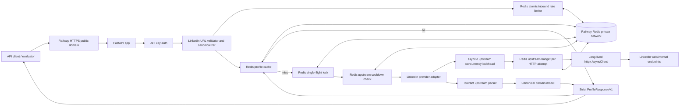
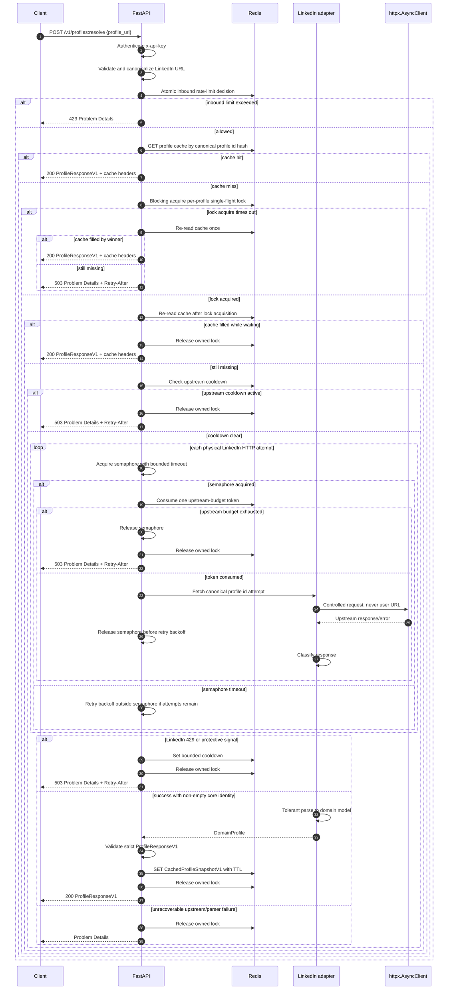
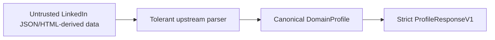
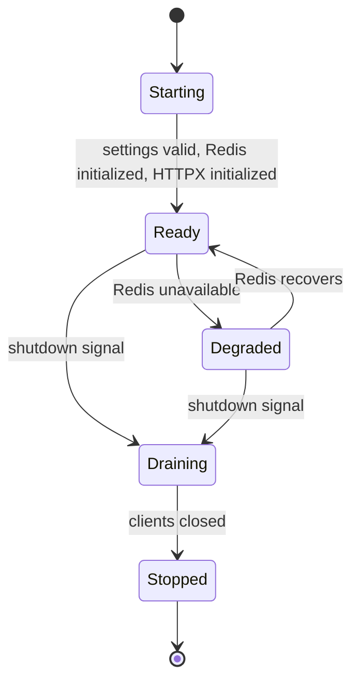
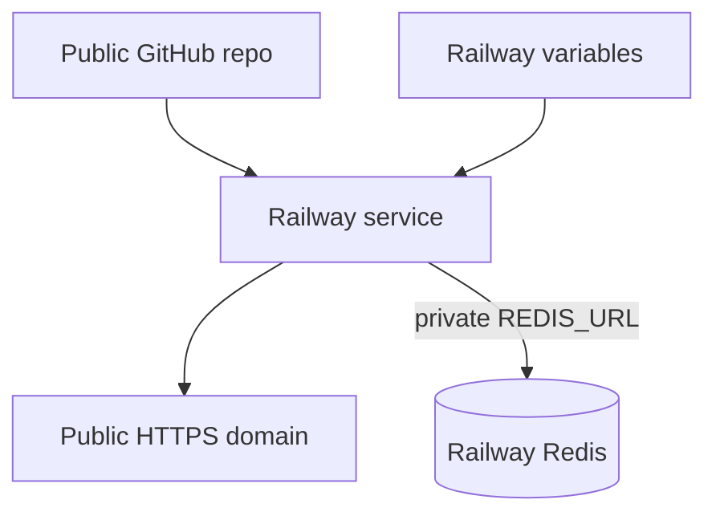

# Tross LinkedIn Profile API - High-Level Design

Status: canonical design package, pre-implementation
Last verified: 2026-08-31

This document is the high-level architecture for the Tross hiring challenge:
build a hosted HTTPS API that accepts a LinkedIn profile URL and returns most
available profile-page information as structured JSON.

The design is intentionally production-minded but scoped for a take-home
challenge. It prioritizes correctness, safe input handling, predictable failure
behavior, observability, and a defendable implementation path over unnecessary
infrastructure.

## Assignment Requirements

Source: `Engineer Hiring Challenge.pdf` from the Tross email.

The API must:

- Be deployed publicly over HTTPS.
- Accept a LinkedIn profile URL as input.
- Return structured JSON containing name, headline, location, about,
  experience, education, skills, certifications, languages, and profile images
  when available.
- Keep credentials and secrets out of the repository.
- Use the candidate's LinkedIn credentials in the backend if needed.
- Submit a public GitHub repository with setup instructions, API documentation,
  approach, and known limitations.

A clarification email says the LinkedIn portion should be a purely
reverse-engineered solution. This design therefore uses normal authenticated
HTTP requests through a bounded provider adapter and explicitly excludes proxy
rotation, TLS fingerprint evasion, CAPTCHA bypass, and other access-control
bypass techniques.

## Verified Documentation Basis

The key technical decisions below were checked against current official or
primary documentation:

| Area | Documentation checked | Design implication |
| --- | --- | --- |
| FastAPI lifespan | https://fastapi.tiangolo.com/advanced/events/ | Create long-lived Redis and HTTPX clients during application lifespan and close them on shutdown. |
| FastAPI API key helpers | https://fastapi.tiangolo.com/reference/security/#fastapisecurityapikeyheader | Use `APIKeyHeader` for OpenAPI-integrated API-key extraction, with custom constant-time verification. |
| HTTPX clients | https://www.python-httpx.org/advanced/clients/ | Use one scoped client for connection pooling and cookie persistence across requests. |
| HTTPX async lifecycle | https://www.python-httpx.org/async/ | Do not create `AsyncClient` instances inside hot request paths; close with `aclose()`. |
| HTTPX timeouts and limits | https://www.python-httpx.org/advanced/timeouts/ and https://www.python-httpx.org/advanced/resource-limits/ | Configure connect/read/write/pool timeouts and connection pool limits explicitly. |
| Pydantic configuration | https://docs.pydantic.dev/latest/api/config/ | Allow tolerance only at the upstream boundary; public models use strict validation and forbid extras. |
| Pydantic strict mode | https://docs.pydantic.dev/latest/concepts/strict_mode/ | Public response validation should fail on wrong types rather than silently coerce. |
| Pydantic aliases | https://docs.pydantic.dev/latest/concepts/alias/ | Use `validation_alias`, `AliasPath`, and `AliasChoices` in parser-facing models if useful. |
| Python URL parsing security | https://docs.python.org/3/library/urllib.parse.html#url-parsing-security | Treat URL parsers as parsers, not validators; validate scheme, host, port, userinfo, and path defensively. |
| LinkedIn public profile URL shape | https://www.linkedin.com/help/linkedin/answer/a522735/find-your-linkedin-public-profile-url and https://www.linkedin.com/help/linkedin/answer/a542685/manage-your-public-profile-url | Accept `www.linkedin.com/in/...` and documented two-letter country subdomains; canonicalize the slug case-insensitively. |
| LinkedIn API rate limits | https://learn.microsoft.com/en-us/linkedin/shared/api-guide/concepts/rate-limits | Do not invent LinkedIn quota numbers; use configurable budgets and respect 429/Retry-After. |
| LinkedIn prohibited automation language | https://www.linkedin.com/help/linkedin/answer/a1341387/prohibited-software-and-extensions | Do not build bypass/evasion systems; stop on challenges and access-control signals. |
| Redis Lua scripting | https://redis.io/docs/latest/develop/programmability/eval-intro/ | Use Lua for atomic read-decide-update rate limiting and safe conditional operations. |
| Redis rate limiter guidance | https://redis.io/docs/latest/develop/use-cases/rate-limiter/ | Use Redis as the shared limiter store; Lua prevents concurrent token double-spend. |
| Redis distributed lock pattern | https://redis.io/docs/latest/develop/clients/patterns/distributed-locks/ | Use unique lock tokens and compare-and-delete semantics for single-flight. |
| redis-py async client | https://redis.io/docs/latest/develop/clients/redis-py/async/ | Use `redis.asyncio`, await commands, share the Redis client across tasks, and close it on shutdown. |
| redis-py lock | https://redis.readthedocs.io/en/stable/lock.html | Use redis-py's lock abstraction rather than hand-rolling lock ownership. |
| RFC 9457 | https://www.rfc-editor.org/rfc/rfc9457.html | Return machine-readable Problem Details errors. |
| OWASP REST security | https://cheatsheetseries.owasp.org/cheatsheets/REST_Security_Cheat_Sheet.html | API keys are acceptable for protected API access, paired with rate limiting and revocation strategy. |
| OWASP logging | https://cheatsheetseries.owasp.org/cheatsheets/Logging_Cheat_Sheet.html | Redact tokens, cookies, secrets, connection strings, and sensitive personal data from logs. |
| Railway healthchecks | https://docs.railway.com/deployments/healthchecks | Use `/health/ready` as deployment healthcheck; Railway does not continuously monitor it after activation. |
| Railway variables | https://docs.railway.com/variables | Put secrets in environment variables; use sealed variables for LinkedIn credentials/session material. |
| Railway Redis | https://docs.railway.com/databases/redis | Use Railway-provided private `REDIS_URL`; do not rewrite `redis://` to `rediss://` unless the server actually supports TLS. |
| Railway private networking | https://docs.railway.com/networking/private-networking | Use private network Redis traffic inside the Railway project. |
| Uvicorn graceful shutdown | https://www.uvicorn.org/server-behavior/ and https://www.uvicorn.org/settings/ | Let Uvicorn finish in-flight responses within the graceful shutdown timeout and close lifespan resources. |
| uv Docker integration | https://docs.astral.sh/uv/guides/integration/docker/ | Use `uv sync --locked` in Docker once implementation begins. |
| Docker secrets | https://docs.docker.com/build/building/secrets/ | Do not pass secrets through Docker `ARG` or `ENV` at build time. |

## Scope Decisions

In scope:

- One FastAPI service.
- Redis for cache, rate limiting, single-flight locks, and explicit upstream
  cooldown state.
- Long-lived `httpx.AsyncClient`.
- Pydantic v2 models.
- API key authentication.
- Redis-backed atomic rate limiting.
- Per-profile single-flight request coalescing.
- Process-local upstream concurrency bulkhead.
- Strict LinkedIn URL validation and canonicalization.
- Tolerant upstream parser, canonical domain model, strict versioned public
  response model.
- Partial success with per-section status and warnings.
- Problem Details errors.
- Docker and Railway deployment.

Explicitly out of scope:

- No L1 in-memory cache.
- No Postgres or persistent database.
- No queues or background workers for the initial challenge API.
- No custom circuit breaker.
- No proxy rotation.
- No TLS fingerprint evasion.
- No CAPTCHA bypass.
- No fake LinkedIn quota, profile visibility, or session lifetime numbers.
- No business logic implementation before the LinkedIn retrieval spike.

## Architecture Overview

## Request Sequence

## Primary Components

### FastAPI Application

Responsibilities:

- Own routing, dependency injection, OpenAPI docs, validation wiring, exception
  handlers, and health endpoints.
- Initialize app-wide resources in lifespan:
  `redis.asyncio.Redis`, `httpx.AsyncClient`, rate-limiter resources, settings,
  provider adapter, and `asyncio.Semaphore`.
- Close Redis and HTTPX clients during shutdown.
- Avoid global mutable business state beyond lifespan-managed dependencies.

Why:

- The service is I/O-bound. FastAPI gives ASGI async support and first-class
  Pydantic/OpenAPI integration.
- FastAPI lifespan is the correct place to create resources that are shared
  across requests and cleaned up at shutdown.

### Authentication Layer

Responsibilities:

- Require `x-api-key` on protected endpoints.
- Store accepted API key digests in environment configuration, not source code.
- Generate high-entropy API keys and store either SHA-256 digests or keyed HMAC
  digests.
- Compare client key material using constant-time comparison.
- Avoid logging raw keys.

Scope:

- No database-backed API key management in the challenge version.
- Missing and invalid API keys both return `401`.
- Reserve `403` for future authenticated callers whose valid key lacks required
  authorization.
- Revocation is done by replacing the configured accepted keys and redeploying.

### URL Canonicalizer

Responsibilities:

- Parse and defensively validate the LinkedIn profile URL.
- Accept only `http` or `https`.
- Accept only:
  - `linkedin.com`
  - `www.linkedin.com`
  - documented two-letter country subdomains such as `ca.linkedin.com`
- Reject userinfo, explicit ports, non-profile paths, embedded control
  characters, invalid or too-long slugs, and malformed hostnames.
- Extract a canonical profile slug from `/in/{slug}` and optional language
  suffix.
- Lowercase the slug because LinkedIn documents custom public profile URLs as
  case-insensitive.
- Discard query strings and fragments.
- Never fetch the original user-supplied URL.

Output:

- `CanonicalProfileUrl(profile_id, canonical_public_url, input_host_type)`.

Security property:

- The upstream provider receives only a controlled profile identifier and builds
  its own internal request. This prevents SSRF-style behavior from user input.

### Redis

Responsibilities:

- Profile response cache.
- Negative cache only for deterministic not-found after Spike 0 proves the
  upstream signal is safe to cache briefly.
- Per-profile single-flight lock.
- Inbound client rate limiter.
- Upstream global request budget consumed once per physical LinkedIn HTTP
  attempt.
- Explicit upstream cooldown after `429`, `Retry-After`, auth challenge, or
  challenge-like responses.

Failure behavior:

- Redis is a critical protective dependency. If Redis is unavailable,
  `/health/live` stays 200, `/health/ready` returns 503, and protected profile
  requests fail closed with 503. The service must not bypass cache, locks, or
  rate limits and directly hit LinkedIn when Redis is down.

### Profile Cache

Responsibilities:

- Store validated, request-independent `CachedProfileSnapshotV1` payloads, not
  raw upstream JSON or whole `ProfileResponseV1` response envelopes.
- Key by canonical profile id hash, not the raw user URL.
- Use configurable TTL.
- Never cache `request_id` or request cache status. The API layer adds the
  current `request_id` and `x-cache: hit|miss` header when building
  `ProfileResponseV1`.

No L1 cache:

- In-memory L1 cache adds replica inconsistency and little value when the
  expensive path is network-bound. Redis-only keeps behavior explainable.

### Single-Flight Lock

Responsibilities:

- Coalesce simultaneous cache misses for the same canonical profile.
- Use Redis lock ownership tokens and safe compare-and-delete release semantics.
- Re-read the cache after acquiring the lock to avoid duplicate upstream calls.
- Bound lock wait time and lock TTL.

Semantics:

- Exactly one request per profile should perform upstream work after a cache
  miss under normal operation.
- All miss-handling uses the same bounded blocking lock-acquire path.
- If lock acquisition times out, reread the cache once. Return the cached result
  if present; otherwise return 503 with `Retry-After`.
- Do not run a separate simultaneous cache polling loop while waiting on the
  lock.

### Atomic Rate Limiter

Responsibilities:

- Protect the public endpoint and the upstream provider budget.
- Use Redis Lua so read, refill, decide, update, and expiry happen atomically.
- Return `allowed`, `remaining`, and `reset_at`.
- Avoid multi-command read-then-increment races.
- Return inbound client limit denials as `429`.
- Return upstream global budget denials as `503` with `Retry-After` because they
  protect the shared LinkedIn session rather than a single client.

Limiter dimensions:

- Inbound per API key hash:
  `tross:v1:rl:api:{api_key_hash}`.
- Upstream global budget:
  `tross:v1:rl:upstream:global`.

No fake LinkedIn quota numbers:

- Upstream limits are configurable conservative safety budgets. They are not
  claims about LinkedIn's actual limits.

### Upstream Concurrency Bulkhead

Responsibilities:

- Bound simultaneous LinkedIn upstream calls inside the process using
  `asyncio.Semaphore`.
- Keep the upstream request count small and predictable even if many cache
  misses arrive at once.
- Acquire the semaphore with a bounded timeout for each physical HTTP attempt
  and release it immediately after that attempt.
- Do not hold the semaphore during retry backoff or response parsing.

Assumption:

- Challenge deployment runs one application replica and one Uvicorn worker.
  With `MAX_UPSTREAM_CONCURRENCY = N`, at most `N` upstream calls run at once.

Scaling caveat:

- If the service is horizontally scaled to `R` replicas, the process-local cap
  becomes `R * N`. At that point the upstream concurrency budget must move to a
  shared queue/coordinator or the configured per-process limit must be reduced.

### LinkedIn Provider Adapter

Responsibilities:

- Own all LinkedIn-specific request construction, headers, cookies, response
  classification, and parser selection.
- Build controlled upstream requests from canonical profile identifiers.
- Never receive or fetch the raw user-supplied URL.
- Use the long-lived HTTPX client.
- Stop on auth/challenge/access-control responses.
- When LinkedIn returns `429`, set a bounded cooldown and return immediate `503`
  with `Retry-After`. Return without issuing another LinkedIn attempt.

Pre-spike status:

- Exact LinkedIn web/internal endpoint paths, required headers, and response
  shapes are not frozen until Spike 0 verifies the current behavior with a test
  account and known profile.

### Parser and Models

The data path is deliberately three-stage:

Responsibilities:

- Tolerant upstream parser:
  - Accept unknown fields.
  - Cope with missing optional sections.
  - Track parser warnings and schema fingerprints.
  - Never expose raw upstream fields directly.
- Canonical domain model:
  - Represent the profile independent of LinkedIn's current payload shape.
  - Preserve field provenance and per-section status where useful.
- Strict public response model:
  - Versioned as `ProfileResponseV1`.
  - Forbid unknown fields.
  - Validate types strictly.
  - Require non-empty core identity before returning `200`.
  - Use fixed typed section-status fields, not an open-ended status dictionary.
  - Use `PartialDate` strings (`YYYY`, `YYYY-MM`, or `YYYY-MM-DD`) for profile
    dates; use RFC 3339 datetimes only for operational timestamps such as
    `fetched_at`.
  - Remain stable when LinkedIn changes upstream payloads.

### Error Handler

Responsibilities:

- Return RFC 9457 Problem Details for all non-2xx API errors.
- Include stable `type`, `title`, `status`, `detail`, `instance`,
  `request_id`, and optional `retry_after_seconds`.
- Avoid exposing upstream cookies, raw LinkedIn responses, internal stack traces,
  or full secrets-bearing URLs.

## Health and Lifecycle

Endpoints:

- `GET /health/live`
  - 200 if the process can serve a basic response.
  - Does not call Redis or LinkedIn.
- `GET /health/ready`
  - 200 only if critical dependencies are usable.
  - Checks settings, Redis connectivity, rate limiter availability, and HTTPX
    client initialization without storing probe keys.
  - Does not call LinkedIn to avoid startup traffic and accidental upstream
    load.

Railway:

- Configure Railway's healthcheck path to `/health/ready`.
- Railway uses healthchecks for deployment activation, not continuous runtime
  monitoring after the deployment is live.

Shutdown:

- Uvicorn handles graceful process shutdown and waits for in-flight responses
  within configured timeouts.
- Lifespan teardown should only close owned resources such as HTTPX and Redis
  clients after Uvicorn's graceful drain. It should not implement a second custom
  drain protocol.

## Security and Privacy

Input safety:

- Strictly validate LinkedIn profile URLs.
- Do not fetch the user URL.
- Bound request body size via app/proxy configuration.
- Do not support arbitrary URLs.

Secret handling:

- `x-api-key`, LinkedIn cookies, CSRF/session material, Redis credentials, and
  deployment secrets are stored in environment variables.
- On Railway, mark LinkedIn session material and API keys as sealed variables.
- The evaluator API key is delivered privately and is never committed.
- Do not pass secrets through Docker build args or committed config files.

Logging:

- Every request gets a `request_id`.
- Log canonical profile id hash, not full raw URL or profile slug when avoidable.
- Redact:
  `authorization`, `x-api-key`, `cookie`, `set-cookie`, `li_at`,
  `JSESSIONID`, CSRF tokens, Redis URL passwords, and upstream response bodies.
- Log parser drift counts and status classes without raw personal data.

Legal/terms posture:

- This is a hiring challenge implementation plan, not a legal opinion.
- The architecture should stop on challenge/access-control signals and should
  not include bypass/evasion systems.

## Deployment Topology

Deployment choices:

- Use Dockerfile for reproducible builds.
- Configure Railway deployment through the Railway dashboard or CLI. Do not
  commit `railway.json` or `railway.toml`.
- Use `uv` for dependency and lockfile management.
- Run one Uvicorn worker and one Railway replica for the challenge submission.
- Listen on Railway-provided `PORT`.
- Use Railway public HTTPS domain for evaluation.
- Use Railway Redis through private `REDIS_URL`.
- Before submission, run one controlled real hosted Railway smoke test against
  the public HTTPS URL with the privately delivered evaluator key.

## Interviewer-Facing Tradeoffs

| Decision | Why | Tradeoff |
| --- | --- | --- |
| Python + FastAPI | Fast iteration, async I/O, Pydantic/OpenAPI integration. | Less raw throughput than lower-level stacks, but upstream network latency dominates. |
| Redis only | Handles cache, locks, rate limits, and cooldown without adding a database. | No durable analytics or multi-tenant account management. |
| No Postgres | Challenge does not need persistent users, billing, or stored profiles. | API key revocation requires env update/redeploy. |
| No L1 cache | Avoids per-replica inconsistency and extra invalidation logic. | Every cache hit pays a Redis round trip. |
| Single-flight per profile | Prevents stampedes on hot uncached profiles. | Followers may wait or receive 503 if the winner is slow. |
| Atomic Redis Lua limiter | Prevents race conditions under concurrent requests. | Script must be tested carefully and kept small. |
| Process-local semaphore | Simple and enough for one-replica challenge deployment. | Must be redesigned for horizontal scale. |
| Fail closed on Redis outage | Prevents unbounded direct LinkedIn calls when protections are gone. | Availability drops if Redis is temporarily unavailable. |
| Strict public response model | Stable API contract independent of upstream drift. | Parser work is slightly more explicit. |
| Partial success | Useful profile data can still be returned if one section drifts. | Clients must inspect section status/warnings. |
| No custom circuit breaker | Simpler, less code to debug, fewer accidental false-open/false-closed states. | Uses bounded retries plus explicit cooldown rather than adaptive failure-rate logic. |
| No evasion/CAPTCHA bypass | Keeps challenge scoped to reverse engineering and robust integration. | Service may stop when LinkedIn challenges or blocks the session. |

## Next Step

Do not implement the provider business logic yet. After this design package is
reviewed, run Spike 0:

1. Use one test LinkedIn account/session.
2. Use one known profile URL.
3. Validate: profile URL -> canonical id -> controlled upstream request ->
   actual response status/content-type/payload shape.
4. Record which sections are available and which parser fixtures are needed.
5. Update only the provider-specific LLD details before full implementation.
