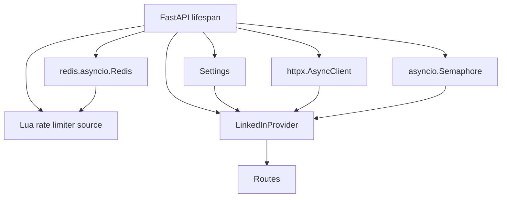
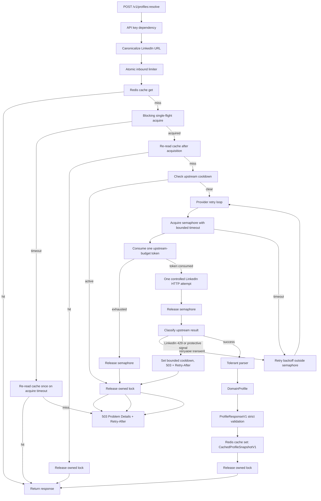

# Tross LinkedIn Profile API - Low-Level Design

Status: canonical low-level design; implementation in progress
Last verified: 2026-08-31

This document defines the intended repository structure, module boundaries,
interfaces, configuration, Redis keys, concurrency semantics, parsing pipeline,
and implementation plan. It is not implementation code.

## Target Repository Structure

```text
.
├── AGENTS.md
├── README.md
├── Dockerfile
├── pyproject.toml
├── uv.lock
├── .env.example
├── .gitignore
├── docs/
│   ├── HLD.md
│   ├── LLD.md
│   ├── API.md
│   ├── FAILURE_MATRIX.md
│   └── TEST_PLAN.md
├── src/
│   └── tross_linkedin_api/
│       ├── __init__.py
│       ├── main.py
│       ├── app.py
│       ├── lifespan.py
│       ├── settings.py
│       ├── logging.py
│       ├── errors.py
│       ├── api/
│       │   ├── __init__.py
│       │   ├── deps.py
│       │   ├── routes_health.py
│       │   └── routes_profiles.py
│       ├── auth/
│       │   ├── __init__.py
│       │   └── api_key.py
│       ├── url/
│       │   ├── __init__.py
│       │   └── linkedin_url.py
│       ├── redis/
│       │   ├── __init__.py
│       │   ├── cache.py
│       │   ├── keys.py
│       │   ├── locks.py
│       │   └── rate_limiter.py
│       ├── linkedin/
│       │   ├── __init__.py
│       │   ├── client.py
│       │   ├── classifier.py
│       │   ├── parser.py
│       │   └── transport.py
│       ├── domain/
│       │   ├── __init__.py
│       │   └── profile.py
│       └── schemas/
│           ├── __init__.py
│           ├── common.py
│           ├── errors.py
│           └── profile_v1.py
└── tests/
    ├── unit/
    │   └── test_scaffold.py
    ├── integration/
    │   └── .gitkeep
    ├── concurrency/
    │   └── .gitkeep
    ├── fixtures/
    │   └── linkedin/
    │       └── .gitkeep
    └── conftest.py
```

Notes:

- This structure is the reviewed Milestone 1 scaffold baseline. It contains no
  LinkedIn retrieval business logic.
- `work/` and `outputs/` are local-only directories ignored by Git and are not
  part of the tracked target structure.
- The `.gitkeep` sentinels preserve intentionally empty test directories across
  Git clones; replace them when those directories gain tracked tests/fixtures.
- Do not create or commit `railway.json` or `railway.toml`.

## Runtime Resource Ownership



Startup:

- Parse settings.
- Configure structured/redacted logging.
- Create Redis async client from `REDIS_URL`.
- Ping Redis for readiness.
- Prepare Lua limiter script source with automatic reload on `NOSCRIPT`; do not
  store Redis helper keys for script state.
- Create one `httpx.AsyncClient` with explicit timeouts, limits, headers, and
  cookie/session material from environment variables.
- Create one process-local `asyncio.Semaphore(MAX_UPSTREAM_CONCURRENCY)`.
- Wire route dependencies.

Shutdown:

- Close `httpx.AsyncClient` with `aclose()`.
- Close Redis with `aclose()`.
- Rely on Uvicorn graceful shutdown timeout to govern in-flight request
  completion; lifespan teardown only closes owned resources.

## Settings and Environment Variables

All values are read via a typed settings object. Secrets must never be committed.

| Variable | Required | Secret | Purpose |
| --- | --- | --- | --- |
| `APP_ENV` | yes | no | `local`, `staging`, or `production`. |
| `APP_NAME` | no | no | Service name for logs and OpenAPI. |
| `PORT` | production | no | Railway-provided port for Uvicorn. |
| `PUBLIC_BASE_URL` | production | no | Public HTTPS base URL for docs and Problem Details type links. |
| `LOG_LEVEL` | no | no | `INFO` by default in production. |
| `API_KEY_HASHES` | yes | yes | Comma-separated hex SHA-256 or HMAC digests of high-entropy API keys. |
| `API_KEY_HMAC_SECRET` | if HMAC | yes | Presence selects HMAC-SHA-256 verification for all configured API-key digests. |
| `REDIS_URL` | yes | yes | Railway private Redis URL or local Redis URL. |
| `REDIS_SOCKET_TIMEOUT_SECONDS` | no | no | Redis command timeout budget. |
| `CACHE_PROFILE_TTL_SECONDS` | yes | no | TTL for successful profile responses. |
| `CACHE_NEGATIVE_TTL_SECONDS` | after Spike 0 | no | Short TTL only for Spike-0-proven deterministic not-found classifications. |
| `SINGLEFLIGHT_LOCK_TTL_SECONDS` | yes | no | Must exceed worst-case bounded upstream operation budget with margin. |
| `SINGLEFLIGHT_WAIT_TIMEOUT_SECONDS` | yes | no | Maximum blocking lock wait after a cache miss. |
| `INBOUND_RATE_LIMIT_CAPACITY` | yes | no | Token bucket size per API key. |
| `INBOUND_RATE_LIMIT_REFILL_PER_SECOND` | yes | no | Token refill rate per API key. |
| `UPSTREAM_RATE_LIMIT_CAPACITY` | yes | no | Conservative global upstream budget; not a LinkedIn quota claim. |
| `UPSTREAM_RATE_LIMIT_REFILL_PER_SECOND` | yes | no | Conservative global refill rate; configurable after observation. |
| `UPSTREAM_COOLDOWN_DEFAULT_SECONDS` | yes | no | Cooldown when upstream signals throttling/challenge without usable `Retry-After`. |
| `UPSTREAM_RETRY_AFTER_MAX_SECONDS` | yes | no | Upper bound for deriving cooldown from `Retry-After`. |
| `MAX_UPSTREAM_CONCURRENCY` | yes | no | Process-local concurrent LinkedIn fetch cap. |
| `HTTPX_MAX_CONNECTIONS` | yes | no | HTTPX connection pool total cap. |
| `HTTPX_MAX_KEEPALIVE_CONNECTIONS` | yes | no | HTTPX keep-alive pool cap. |
| `HTTPX_KEEPALIVE_EXPIRY_SECONDS` | no | no | HTTPX keep-alive expiry. |
| `UPSTREAM_CONNECT_TIMEOUT_SECONDS` | yes | no | HTTPX connect timeout. |
| `UPSTREAM_READ_TIMEOUT_SECONDS` | yes | no | HTTPX read timeout. |
| `UPSTREAM_WRITE_TIMEOUT_SECONDS` | yes | no | HTTPX write timeout. |
| `UPSTREAM_POOL_TIMEOUT_SECONDS` | yes | no | HTTPX pool acquisition timeout. |
| `UPSTREAM_MAX_ATTEMPTS` | yes | no | Bounded retry attempts for transient failures. |
| `UPSTREAM_RETRY_MAX_SLEEP_SECONDS` | yes | no | Max exponential jitter sleep between attempts. |
| `LINKEDIN_LI_AT` | spike/prod | yes | LinkedIn session cookie if required by Spike 0. |
| `LINKEDIN_JSESSIONID` | spike/prod | yes | LinkedIn session cookie; optional outer literal quotes are normalized to the proven quoted cookie form. |
| `LINKEDIN_CSRF_TOKEN` | spike/prod | yes | Must equal `LINKEDIN_JSESSIONID` with its outer literal quotes removed. |
| `LINKEDIN_USER_AGENT` | yes | no | Normal descriptive user agent. Do not claim browser impersonation/evasion. |
| `LINKEDIN_BASE_URL` | yes | no | Controlled upstream base, normally `https://www.linkedin.com`. |
| `SCHEMA_DRIFT_SAMPLE_LOGGING` | no | no | Boolean for sanitized drift diagnostics only. |

Railway notes:

- Mark `API_KEY_HASHES`, `API_KEY_HMAC_SECRET` when used, LinkedIn session material, and
  Redis credentials as sealed/sensitive variables where possible.
- Deliver the evaluator API key privately and never commit it.
- Use the Railway-provided `REDIS_URL` as supplied. Do not change schemes unless
  Redis itself is configured for TLS.
- Listen on `PORT`.
- Configure healthcheck path to `/health/ready`.

## URL Canonicalization Design

Input:

```json
{
  "profile_url": "https://www.linkedin.com/in/example-person/?trk=public_profile"
}
```

Output:

```text
CanonicalProfileUrl(
  profile_id="example-person",
  canonical_public_url="https://www.linkedin.com/in/example-person",
  input_host_type="www"
)
```

Validation algorithm:

1. Require string input and trim leading/trailing ASCII whitespace.
2. Reject empty input and input longer than `MAX_PROFILE_URL_LENGTH` default
   target of 2048 characters.
3. Reject any embedded C0 control character, newline, carriage return, tab, or
   non-printing character before parsing.
4. Parse with `urllib.parse.urlsplit`.
5. Reject missing scheme or host.
6. Require scheme `http` or `https`. `http` input is accepted only because the
   service never fetches the supplied URL and always constructs its own HTTPS
   upstream request.
7. Reject `username:password@host` userinfo.
8. Reject explicit ports, including default ports, to keep the accepted shape
   narrow.
9. Lowercase and IDNA-normalize hostname. Require ASCII hostname.
10. Accept only:
    - `linkedin.com`
    - `www.linkedin.com`
    - `[a-z][a-z].linkedin.com`
11. Split path segments.
12. Require path `/in/{slug}` or `/in/{slug}/{language}`.
13. Validate slug:
    - 3 to 100 characters.
    - ASCII letters, digits, and hyphen only.
    - Case-insensitive, canonicalized to lowercase.
    - Reject the literal word `linkedin` if used as the entire slug.
14. Optional language suffix:
    - 2 lowercase ASCII letters initially.
    - Captured as metadata but not used as the primary profile id.
15. Discard query and fragment.
16. Return canonical public URL using `https://www.linkedin.com/in/{slug}`.

Important invariant:

```text
No code path may call httpx with the original user-supplied URL.
```

## Public API Flow



## Domain Model

The domain model is provider-independent and can be implemented as Pydantic
models or dataclasses. It is not exposed directly to clients.

Core types:

```text
DomainProfile
  canonical_profile_id: str
  canonical_profile_url: str
  fetched_at: datetime
  source: Literal["linkedin"]
  source_status: SourceStatus
  identity: Identity
  about: FieldValue[str | None]
  experience: Section[list[ExperienceItem]]
  education: Section[list[EducationItem]]
  skills: Section[list[SkillItem]]
  certifications: Section[list[CertificationItem]]
  languages: Section[list[LanguageItem]]
  images: ProfileImages
  parser: ParserMetadata
```

`FieldValue[T]`:

- `value: T`
- `status: available | missing | unavailable | parse_error`
- `source_path: str | None`

`Section[T]`:

- `items: T`
- `status: complete | partial | empty | unavailable | parse_error`
- `warnings: list[ParserWarning]`

`ParserMetadata`:

- `parser_version`
- `schema_fingerprint`
- `warnings`
- `raw_payload_kind`
- `sections_seen`

`PartialDate`:

- String used for profile dates only.
- Accepted shapes are `YYYY`, `YYYY-MM`, and `YYYY-MM-DD`.
- Do not coerce incomplete profile dates into RFC 3339 datetimes.

## Public Response Model

`ProfileResponseV1` is strict and stable.

Pydantic settings:

- `ConfigDict(extra="forbid", strict=True, validate_by_name=True, validate_by_alias=True)`
- Use explicit field types.
- Use `PartialDate` for profile dates and RFC 3339 datetimes only for
  operational timestamps such as `fetched_at`, `stored_at`, and `expires_at`.
- Do not expose `__pydantic_extra__`.
- Do not expose raw upstream JSON.

High-level shape:

```text
ProfileResponseV1
  api_version: "v1"
  request_id: str
  profile:
    canonical_id: str
    canonical_url: str
    name: NonEmptyStr
    headline: str | None
    location: str | None
    about: str | None
    images: ProfileImages
    experience: list[ExperienceItem]
    education: list[EducationItem]
    skills: list[SkillItem]
    certifications: list[CertificationItem]
    languages: list[LanguageItem]
  sections: ProfileSectionStatusesV1
  warnings: list[ResponseWarning]
  cache: CacheMetadata
  fetched_at: datetime
```

`ProfileSectionStatusesV1` is a fixed typed object with these keys:
`identity`, `about`, `experience`, `education`, `skills`, `certifications`,
`languages`, and `images`. Each value is a `SectionStatus` with
`status`, `item_count`, and optional warning codes.

`CacheMetadata` contains `stored_at` and `expires_at` only. Cache hit/miss status
is exposed only through the `x-cache` response header.

`CachedProfileSnapshotV1` is the Redis-stored value. It contains the
request-independent profile data, fixed section statuses, warnings, fetched
timestamp, and cache timestamps. It does not contain `request_id`,
cache hit/miss status, or any other per-request response metadata.

Partial success:

- Return `200` only when a meaningful profile response with non-empty core
  identity can be produced, even if optional sections are missing or fail
  parsing.
- Mark section status explicitly.
- Include warnings such as `section_parse_error`, `section_unavailable`, or
  `profile_visibility_limited`.
- A visibility-limited profile that still exposes usable identity is a partial
  `200`, not a negative-cache result.
- Return non-2xx only when the service cannot produce a trustworthy profile
  response, input is invalid, authentication fails, dependencies are down, or
  upstream access is unavailable.

## Redis Key Patterns

Use a single versioned prefix so keys can be migrated safely:

```text
tross:v1:cache:profile:{profile_id_hash}
tross:v1:negcache:profile:{profile_id_hash}
tross:v1:lock:profile:{profile_id_hash}
tross:v1:rl:api:{api_key_hash}
tross:v1:rl:upstream:global
tross:v1:cooldown:linkedin
```

Hashing:

- `profile_id_hash = hex(sha256(profile_id.lower()))` or keyed BLAKE2/HMAC if
  profile identifiers should not be recoverable from logs/keys.
- `api_key_hash` is never the raw API key. Use high-entropy API keys and store
  either `sha256(api_key)` digests or `hmac_sha256(secret, api_key)` digests.

TTL ownership:

| Key | Owner | TTL |
| --- | --- | --- |
| `cache:profile` | `ProfileCache` | `CACHE_PROFILE_TTL_SECONDS` |
| `negcache:profile` | `ProfileCache` | `CACHE_NEGATIVE_TTL_SECONDS` |
| `lock:profile` | `SingleFlight` | `SINGLEFLIGHT_LOCK_TTL_SECONDS` |
| `rl:api` | `RateLimiter` | Derived from refill/capacity window |
| `rl:upstream` | `RateLimiter` | Derived from refill/capacity window |
| `cooldown:linkedin` | `LinkedInProvider` | `Retry-After` or configured fallback |

Redis cluster note:

- The initial Railway Redis deployment is standalone. If Redis Cluster is later
  used, Lua scripts must access keys in the same hash slot and must receive all
  accessed key names through `KEYS`.

## Cache Semantics

Stored value:

- Serialized `CachedProfileSnapshotV1` JSON.
- Includes only request-independent profile data, fixed section statuses,
  warnings, fetched timestamp, and `stored_at`/`expires_at`.
- Excludes `request_id`, cache hit/miss status, and per-request headers.
- Optional compression is out of scope unless payloads become large.

Read path:

1. Build cache key from canonical profile id hash.
2. `GET` cache.
3. Parse JSON.
4. Validate against `CachedProfileSnapshotV1`.
5. If validation fails, treat as cache corruption:
   - delete the key if possible,
   - continue as cache miss,
   - log sanitized warning.
6. Build `ProfileResponseV1` for the current request by adding `request_id`,
   `cache` timestamps, and `x-cache: hit`.

Write path:

1. Build and validate `CachedProfileSnapshotV1`.
2. Serialize JSON.
3. `SET key value EX ttl`.
4. Return the current request with `x-cache: miss`.

Negative cache:

- Disabled until Spike 0 proves a deterministic not-found signal that is safe to
  cache briefly.
- A generic upstream `404` is not automatically safe to cache before Spike 0.
- Do not negative-cache visibility-limited profiles when a usable core identity
  can still be returned as partial `200`.
- Do not negative-cache auth/session-invalid errors for long periods.

## Single-Flight Lock Semantics

Implementation:

- Use `redis.asyncio.Redis.lock(...)` if supported cleanly by the installed
  redis-py version.
- If redis-py async lock ergonomics are insufficient, implement the documented
  Redis pattern:
  `SET lock_key token NX PX ttl_ms`, release with Lua compare-and-delete.
- In either case, lock ownership token must be unique per acquisition.

Flow:

1. Cache miss.
2. Try one blocking lock acquire with
   `blocking_timeout=SINGLEFLIGHT_WAIT_TIMEOUT_SECONDS`.
3. If acquisition times out:
   - re-read cache once,
   - return cached response if another request filled it,
   - otherwise return 503 with short `Retry-After`.
4. If acquisition succeeds:
   - re-read cache once after acquiring the lock,
   - return cached response if it is now present,
   - otherwise perform upstream work as the lock owner.
5. Store `CachedProfileSnapshotV1` on success.
6. Release only if still owner.

Do not run a second cache polling loop while the Redis blocking acquire is
already waiting.

Lock TTL sizing:

```text
SINGLEFLIGHT_LOCK_TTL_SECONDS >
  worst_case_upstream_attempt_budget
  + worst_case_retry_sleep_budget
  + cache_write_budget
  + safety_margin
```

Do not set a lock TTL shorter than the total bounded upstream operation. If the
lock expires while the winner is still fetching, a second request can acquire it
and duplicate upstream work.

## Atomic Rate Limiter Design

Use a Redis Lua token bucket for both inbound API keys and upstream global
budget.

Input:

```text
KEYS[1] = limiter key
ARGV[1] = capacity
ARGV[2] = refill_tokens_per_second
ARGV[3] = requested_tokens
ARGV[4] = ttl_seconds
```

Script behavior:

1. Read Redis server time.
2. Read current token count and last refill timestamp from a Redis hash.
3. Refill based on elapsed time.
4. If enough tokens exist:
   - subtract requested tokens,
   - write new token count and timestamp,
   - set expiry,
   - return allowed.
5. If not enough tokens:
   - write refreshed state,
   - set expiry,
   - return denied with remaining tokens and reset estimate.

Return:

```json
{
  "allowed": true,
  "remaining": 12,
  "reset_at_ms": 1788130000000,
  "retry_after_ms": 0
}
```

Why Lua:

- Separate `GET` -> decide -> `INCR` or `HSET` commands are race-prone under
  concurrency. Redis scripts execute atomically on the server, preventing token
  double-spend.

Status mapping:

- Inbound limit exceeded: `429 Too Many Requests`.
- Upstream budget exhausted by local policy: `503 Service Unavailable` with
  `Retry-After`.

Upstream budget rule:

- Each physical LinkedIn HTTP attempt consumes exactly one upstream-budget token.
- A retry sequence with three actual HTTP attempts consumes three tokens.
- Semaphore acquisition timeouts do not consume upstream tokens because no
  physical LinkedIn HTTP attempt was made.

## Upstream Cooldown

The cooldown key is not a custom circuit breaker. It is explicit state derived
from an upstream/protective signal.

Set `tross:v1:cooldown:linkedin` when:

- Upstream returns `429`.
- Upstream provides `Retry-After`.
- Upstream returns an auth challenge, checkpoint, CAPTCHA, or other access
  control/challenge signal.
- Repeated transient failures exhaust the bounded retry budget and local policy
  chooses a short protective pause.

Read path:

- Before entering the provider attempt loop, check cooldown key.
- If present, return 503 Problem Details with `Retry-After`.
- If LinkedIn returns `429`, set a bounded cooldown using parsed `Retry-After`
  capped by policy, or the configured fallback, then return immediate 503 with
  `Retry-After`. Return without issuing another LinkedIn attempt.

## HTTPX Client Design

One `httpx.AsyncClient` per app process:

- Created during FastAPI lifespan.
- Shared by provider adapter.
- Closed on shutdown.
- Explicit `httpx.Timeout(connect=..., read=..., write=..., pool=...)`.
- Explicit `httpx.Limits(max_connections=..., max_keepalive_connections=...)`.
- Cookie/session material attached through controlled client configuration or
  request builder.

No hot-loop client creation:

- Do not instantiate `AsyncClient` per request or per retry attempt.

Request construction:

- Provider receives only canonical profile id.
- Provider builds a controlled URL from `LINKEDIN_BASE_URL` plus the verified
  endpoint path found by Spike 0.
- Provider applies required headers discovered by Spike 0.
- Provider does not attempt proxy rotation, TLS fingerprint spoofing, or CAPTCHA
  handling.
- For each physical HTTP attempt, acquire the process semaphore with a bounded
  timeout, consume one upstream-budget token immediately before the outbound
  HTTP call, release the semaphore immediately after that call, then perform any
  retry backoff outside the semaphore.

### Spike-0B-Frozen Voyager Contract

All requests are sequential `GET /voyager/api/graphql` calls with
`includeWebMetadata=true`, the lifespan-owned authenticated client,
`follow_redirects=False`, `trust_env=False`, and no retries in the current
vertical slice.

The proven client sends `accept: application/vnd.linkedin.normalized+json+2.1`,
`accept-language: en-US,en;q=0.9`, `csrf-token`, the configured descriptive
`user-agent`, and `x-restli-protocol-version: 2.0.0`, plus `li_at` and the
literal-quoted `JSESSIONID` cookies. The CSRF value equals the JSESSIONID token
with its outer quotes removed.

| Sequence | Query ID | Variables |
| --- | --- | --- |
| 1 | `voyagerIdentityDashProfiles.34ead06db82a2cc9a778fac97f69ad6a` | `(vanityName:{canonical_profile_id})` |
| 2 | `voyagerIdentityDashProfileComponents.86824295e1093fb0f5acdd8d57213aaa` | `(profileUrn:{percent_encoded_correlated_profile_urn},sectionType:content-collections)` |
| 3 | `voyagerIdentityDashProfileCards.aec4c2601fac8c5f615c7630b8db1ab3` | `(profileUrn:{percent_encoded_correlated_profile_urn},sectionType:CONTENT_COLLECTIONS_DETAILS)` |

The first response must root-reference exactly one controlled `fsd_profile` URN
whose `publicIdentifier` matches the requested canonical id before calls two and
three occur. Every response uses
`application/vnd.linkedin.normalized+json+2.1`, contains object `data` and array
`included`, and must include the same correlated profile URN. Repeated normalized
entities merge by `entityUrn`; unknown fields remain tolerated.

The sanitized Spike 0B evidence proves value-level identity and VectorImage
profile/background image mapping. About was not observed. Experience,
education, skills, certifications, and languages have structural signals only;
they therefore remain empty with `unavailable` status and warnings until
sanitized value-level fixtures prove a mapper.

## Upstream Response Classifier

Classifier output:

```text
UpstreamClassification
  kind:
    success_json
    success_html
    not_found
    auth_required
    challenge_or_checkpoint
    rate_limited
    transient_failure
    permanent_failure
    malformed_payload
  retry_after_seconds: int | None
  cacheable_negative: bool
  safe_to_retry: bool
```

Classification rules:

- `2xx` with expected JSON content type: parse.
- `2xx` with HTML or unexpected content: inspect for login/challenge markers;
  otherwise `malformed_payload`.
- `401`/`403`: upstream auth/access error, no retry.
- `404`: possible profile-not-found or visibility issue. Before Spike 0, do not
  treat generic `404` as safely cacheable deterministic not-found.
- `408`, `425`, `429`, `5xx`: transient or rate-limited depending on headers
  and body.
- Network timeouts: transient within retry budget.
- CAPTCHA/checkpoint: stop and return operational error; do not bypass.

## Retry and Timeout Policy

Retry only:

- HTTPX transport/network errors.
- Connect/read/pool timeouts.
- Upstream `408`, selected `5xx`.

Do not retry:

- Invalid client input.
- Auth failure to this API.
- LinkedIn login required, checkpoint, CAPTCHA, or access-control pages.
- LinkedIn `429`; set bounded cooldown and return immediate 503 with
  `Retry-After`.
- Parser/schema errors.
- `404` profile not found.
- `4xx` other than explicitly retryable cases.

Use Tenacity:

- `stop_after_attempt(UPSTREAM_MAX_ATTEMPTS)`.
- `wait_random_exponential(max=UPSTREAM_RETRY_MAX_SLEEP_SECONDS)`.
- `reraise=True`.
- Redacted before-sleep logging only.

Operation budget:

- Total bounded timeout and retry delay must be less than:
  `SINGLEFLIGHT_LOCK_TTL_SECONDS` minus safety margin.
- The semaphore is held only for a single physical HTTP attempt, never during
  retry backoff.

## Parser Strategy

The parser is provider-specific but outputs `DomainProfile`.

Layers:

1. Raw payload decoder:
   - Validate content type and encoding.
   - Parse JSON or controlled HTML-derived embedded data if Spike 0 proves that
     is necessary.
2. Tolerant extractor:
   - Navigate expected paths with helper functions.
   - Unknown fields are ignored.
   - Missing optional sections produce `empty` or `unavailable`.
   - Section-level exceptions become warnings, not full request failure, when
     core identity remains valid.
3. Canonical mapper:
   - Normalize dates, organizations, role titles, image URLs, and text fields.
   - Deduplicate repeated items.
   - Preserve ordering as seen upstream where meaningful.
4. Strict response builder:
   - Build `ProfileResponseV1`.
   - Validate with strict public schema.

Schema drift handling:

- Parser has a `PARSER_VERSION`.
- Compute a coarse schema fingerprint from top-level keys and section paths,
  not from personal data values.
- Log drift events with request id, parser version, profile id hash, and section
  names only.
- Add sanitized fixtures for each new payload shape.
- Preserve public API compatibility across parser updates.

## Health Endpoints

`GET /health/live`:

```json
{
  "status": "live",
  "service": "tross-linkedin-profile-api"
}
```

`GET /health/ready`:

```json
{
  "status": "ready",
  "checks": {
    "settings": "ok",
    "redis": "ok",
    "http_client": "ok",
    "rate_limiter": "ok"
  }
}
```

Readiness failure:

```json
{
  "status": "not_ready",
  "checks": {
    "redis": "failed"
  }
}
```

Do not call LinkedIn from readiness checks.

## Error Types

Stable internal exceptions:

```text
InvalidProfileUrlError
ApiKeyMissingError
ApiKeyInvalidError
RateLimitExceededError
RedisUnavailableError
SingleFlightTimeoutError
UpstreamBudgetExceededError
UpstreamCooldownActiveError
LinkedInAuthRequiredError
LinkedInChallengeError
LinkedInRateLimitedError
LinkedInTransientError
LinkedInPermanentError
ProfileNotFoundError
SchemaDriftError
PublicResponseValidationError
```

All are mapped to Problem Details in `docs/API.md`.

## Observability

Structured log fields:

```text
timestamp
level
service
env
request_id
route
method
status_code
duration_ms
api_key_hash_prefix
profile_id_hash
cache_status
singleflight_role
rate_limit_allowed
upstream_classification
retry_attempt
parser_version
schema_fingerprint
section_status_summary
```

Never log:

- API keys.
- LinkedIn cookies.
- CSRF tokens.
- `Cookie` or `Set-Cookie` headers.
- Raw upstream response body.
- Redis URL with password.
- Full profile URL when a hash is enough.

Metrics can initially be log-derived. A Prometheus endpoint is optional and not
required for the challenge.

## Deployment Design

Docker:

- Use `uv` and locked dependencies.
- Build without secrets.
- Runtime reads env vars injected by Railway.
- Run Uvicorn against `tross_linkedin_api.main:app`.
- Bind `0.0.0.0:${PORT}`.
- Configure graceful shutdown timeout.

Railway:

- One web service.
- One Redis service.
- Public HTTPS domain enabled.
- `REDIS_URL=${{Redis.REDIS_URL}}` or equivalent service reference.
- Healthcheck path `/health/ready`.
- One replica and one Uvicorn worker for challenge submission.
- Configure deployment settings through Railway dashboard or CLI. Do not commit
  `railway.json` or `railway.toml`.

## Implementation Milestones

Milestone 0 - design package (reviewed and complete):

- Create `docs/HLD.md`, `docs/LLD.md`, `docs/API.md`,
  `docs/FAILURE_MATRIX.md`, `docs/TEST_PLAN.md`, and `AGENTS.md`.
- Stop for review.

Milestone 1 - scaffold only (reviewed and complete):

- Create Python/uv project, package structure, empty modules, tests folders,
  `.env.example`, Dockerfile, Railway dashboard/CLI notes, and README skeleton.
- Add repository hygiene and sentinels for intentionally empty test directories.
- No LinkedIn retrieval logic.
- Run formatting/import/test skeleton checks.
- Stop.

Milestone 2 - Spike 0 LinkedIn retrieval (next approved bounded milestone):

- Use a test LinkedIn session and one known profile.
- Prove controlled request path and response shape.
- Save sanitized fixtures.
- Update provider-specific parser LLD.
- Stop for review.

Milestone 3 - core API implementation:

- Implement settings, logging, errors, URL canonicalizer, API auth, Redis cache,
  single-flight, rate limiter, health endpoints, and public schemas.

Milestone 4 - provider/parser implementation:

- Implement LinkedIn provider based on Spike 0.
- Implement tolerant parser and canonical mapper.
- Add fixtures and parser tests.

Milestone 5 - hardening:

- Concurrency tests.
- Redis failure tests.
- Retry/cooldown tests.
- Local Docker smoke test.
- One controlled real hosted Railway smoke test before submission.
- README finalization.

Current instruction:

- Milestones 1 and 2 are reviewed and complete.
- The production vertical slice is implemented with mocked tests and the frozen
  three-query contract above.
- Redis/cache/single-flight/rate-limit/cooldown/bulkhead, readiness, deployment,
  and live hosted smoke work remain deferred. Do not broaden the current review
  into those milestones.
